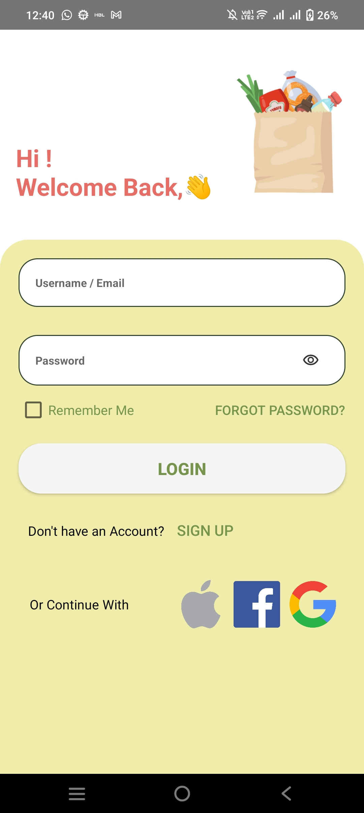
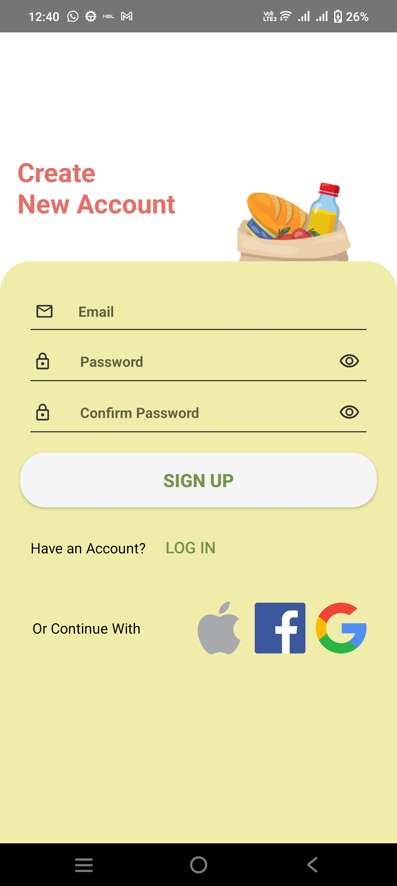

# Grocery Deals – JavaAi Android App

An Android application for managing grocery deals and shopping lists, with an AI-powered assistant.

## Project Structure

```
app/
├── JavaAi/              # Android Studio project
│   ├── app/
│   │   └── src/main/
│   │       ├── java/com/example/javaai/   # Java/Kotlin source files
│   │       └── res/                        # Resources (layouts, drawables, etc.)
│   ├── build.gradle.kts
│   └── settings.gradle.kts
└── screenshorts/        # App screenshots
```

## STAR Feature Highlights

- ⭐ **AI Grocery Assistant**
  - **Situation:** Shoppers need quick guidance while planning meals and deals.
  - **Task:** Provide in-app, conversational suggestions without leaving the app.
  - **Action:** Integrated a Gemini-powered chat with message bubbles and conversation history.
  - **Result:** Users can ask questions and receive real-time, context-aware responses.

- ⭐ **Secure Authentication & Google Sign-In**
  - **Situation:** Users expect fast, trusted access to their accounts.
  - **Task:** Offer reliable login/signup flows with familiar identity providers.
  - **Action:** Implemented Firebase Authentication, Google Sign-In, password visibility toggles, and remember-me storage.
  - **Result:** Smooth onboarding with fewer login drop-offs.

- ⭐ **Password Recovery with OTP**
  - **Situation:** Users forget passwords and need quick recovery.
  - **Task:** Provide a clear, guided reset flow.
  - **Action:** Added email validation, OTP generation, and verification UI for recovery.
  - **Result:** Users can regain access without support tickets.

- ⭐ **Smart Shopping Lists**
  - **Situation:** Shoppers need a lightweight way to create and track lists.
  - **Task:** Enable list creation and item management that works offline.
  - **Action:** Built Create List + Items screens with RecyclerView and SharedPreferences persistence.
  - **Result:** Lists stay available across sessions without extra setup.

- ⭐ **Bottom Navigation & Settings**
  - **Situation:** Users want quick access to lists, AI help, and settings.
  - **Task:** Provide fast navigation between core experiences.
  - **Action:** Implemented bottom navigation with dedicated List, AI, and Settings destinations plus logout actions.
  - **Result:** Core features stay one tap away.

- ⭐ **AdMob Monetization Ready**
  - **Situation:** The app needs a clear monetization path.
  - **Task:** Integrate ads without blocking the core flow.
  - **Action:** Added banner and interstitial AdMob placements with load handling.
  - **Result:** Monetization-ready surfaces are in place.

- ⭐ **Animated Splash Experience**
  - **Situation:** First impressions matter during app launch.
  - **Task:** Deliver a polished opening sequence.
  - **Action:** Implemented a video-based splash animation before entering the app.
  - **Result:** A smoother, more branded startup experience.

## Requirements

- Android Studio Hedgehog or later
- Android SDK 26+ (minSdk 26, targetSdk 35)

## Configuration

- Add your Gemini key to `local.properties` (or export `GEMINI_API_KEY`):
  - `GEMINI_API_KEY=your_key_here`
- `google-services.json` is already included in `JavaAi/app/` for Firebase.
- Update AdMob test device ID and ad unit IDs if needed.

## Getting Started

1. Clone this repository.
2. Open `app/JavaAi` in Android Studio.
3. Add `GEMINI_API_KEY` to `local.properties`.
4. Let Gradle sync the project dependencies.
5. Run the app on an emulator or physical device (API 26+).

## Screenshots







## Tech Stack

| Layer | Technology |
|-------|-----------|
| Language | Java & Kotlin |
| UI | XML Layouts, Material Design |
| Auth | Firebase Authentication |
| Database | Firebase Firestore |
| AI | Gemini / OpenAI integration |
| Ads | Google AdMob |
| Build | Gradle (Kotlin DSL) |
