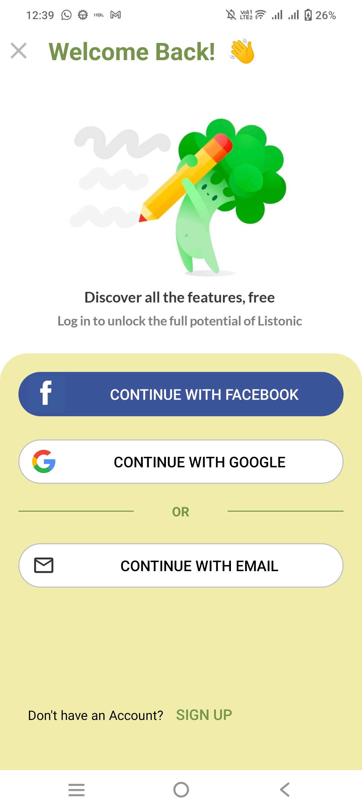
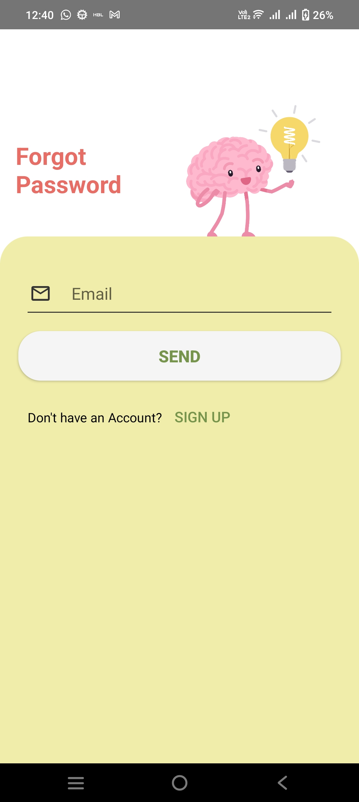
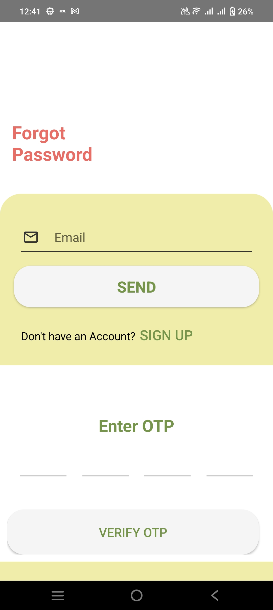

# Grocery Deals


## Project Description

Grocery Deals is an AI-powered Android grocery assistant that combines multi-turn Gemini conversations, offline-persistent shopping lists, and Firebase authentication — all under a single bottom-navigation shell. It is built to production standards with secure build-time API-key injection and a monetisation-ready AdMob integration.

---

## Screenshots


|  |  |  |  |

> **Capture tips:** For the best screenshots, capture (1) the login screen with the Google button visible, (2) the list view with at least two saved lists, (3) a multi-turn AI conversation showing both user and assistant bubbles, and (4) the settings/profile screen.

---

## Key Features

- 🤖 **Stateful Gemini AI Chat** — engineered a multi-turn conversation engine that appends every user/AI exchange to an in-memory history buffer and passes the full context to `gemini-1.5-flash` on each request, enabling coherent, session-aware grocery advice without a backend.
- 🔐 **Firebase Auth + Google Sign-In** — implemented the full OAuth handshake (`GoogleSignInOptions` → `GoogleAuthProvider.getCredential` → Firebase credential exchange), password-visibility toggle, and a "Remember Me" flow backed by SharedPreferences — reducing friction at every login step.
- 📧 **OTP Password Recovery** — built a 4-digit OTP generator with `java.util.Random`, client-side email-format validation via `Patterns.EMAIL_ADDRESS`, and a Fragment-based verification screen wired through a `Bundle` argument pipeline — all without a third-party SDK.
- 📋 **Offline-Persistent Shopping Lists** — architected a full CRUD layer on top of SharedPreferences (`Set<String>` for list names + per-list item sets), surfaced through a `RecyclerView`-backed `ListFragment` with swipe-to-delete and live adapter refresh — lists survive process death with zero cloud dependency.
- 🎬 **Immersive Video Splash Screen** — built a `VideoView`-driven branded launch experience with muted, non-looping playback and full system-UI immersive mode (`SYSTEM_UI_FLAG_FULLSCREEN | SYSTEM_UI_FLAG_HIDE_NAVIGATION`), auto-navigating to `MainActivity` on completion.
- 🔑 **Secure Build-Time API Key Injection** — configured Gradle (Kotlin DSL) to read `GEMINI_API_KEY` from `local.properties` **or** a CI/CD environment variable, inject it as a `BuildConfig` field, and apply string escaping — API secrets are never committed to source control.
- 💰 **AdMob Monetisation Ready** — integrated banner and interstitial ad placements with load-state handling, providing a clear monetisation surface that does not block core user flows.

---

## Tech Stack

| Layer | Technology |
|-------|------------|
| Language | Java & Kotlin |
| UI | XML Layouts · Material Design · View Binding |
| Auth | Firebase Authentication · Google Sign-In |
| Storage | Firebase Storage · SharedPreferences |
| AI | Google Gemini AI (`gemini-1.5-flash`) |
| Ads | Google AdMob |
| Build | Gradle (Kotlin DSL) |
| Min SDK | 26 (Android 8.0) |
| Target SDK | 35 (Android 15) |

---

## Prerequisites

- Android Studio Hedgehog (2023.1.1) or later
- Android SDK API 26+
- A [Google Gemini API key](https://aistudio.google.com/app/apikey)

---

## Installation & Usage

```bash
# 1. Clone the repository
git clone https://github.com/allech01/Grocery-Deals.git
cd Grocery-Deals

# 2. Open the Android project in Android Studio
#    File → Open → select the  app/JavaAi  folder

# 3. Add your Gemini API key to local.properties
echo "GEMINI_API_KEY=your_key_here" >> app/JavaAi/local.properties

# 4. Sync Gradle and run
#    Click "Sync Now" in Android Studio, then Run ▶ on an emulator or physical device (API 26+)
```

> **Note:** `google-services.json` is already included in `app/JavaAi/app/` for Firebase. Update AdMob ad unit IDs in the source if you plan to publish.

---

## Project Structure

```
Grocery-Deals/
├── app/
│   ├── JavaAi/                          # Android Studio project root
│   │   ├── app/
│   │   │   └── src/main/
│   │   │       ├── java/com/example/javaai/
│   │   │       │   ├── AiFragment.kt              # Gemini multi-turn chat
│   │   │       │   ├── AnimatedLogoActivity.java  # Video splash screen
│   │   │       │   ├── LoginPageActivity.java     # Firebase + Google Sign-In
│   │   │       │   ├── ForgotPasswordActivity.java # OTP generation & routing
│   │   │       │   ├── OtpVerificationActivity.java # OTP verification fragment
│   │   │       │   ├── CreateList.java            # New list + item creation
│   │   │       │   ├── ItemsActivity.java         # Per-list item management
│   │   │       │   ├── ListFragment.java          # RecyclerView list browser
│   │   │       │   ├── MainActivity.java          # Bottom navigation host
│   │   │       │   └── SettingFragment.java       # Settings & logout
│   │   │       └── res/                           # Layouts, drawables, menus
│   │   ├── build.gradle.kts
│   │   └── settings.gradle.kts
│   └── screenshorts/                    # App screenshots
└── README.md
```
